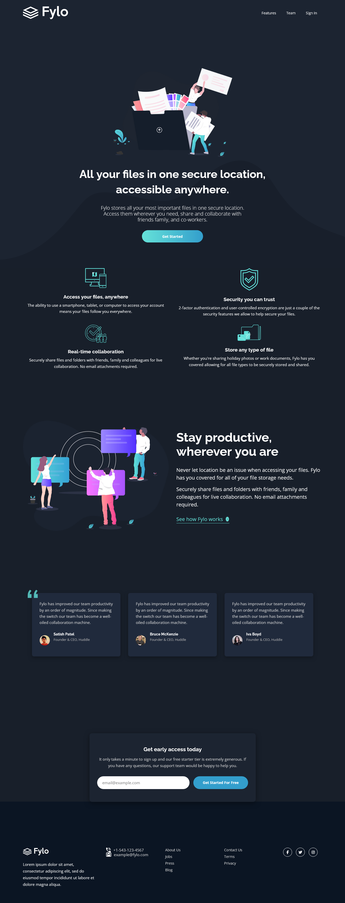

# Frontend Mentor - Fylo dark theme landing page solution

This is a solution to the [Fylo dark theme landing page challenge on Frontend Mentor](https://www.frontendmentor.io/challenges/fylo-dark-theme-landing-page-5ca5f2d21e82137ec91a50fd). Frontend Mentor challenges help you improve your coding skills by building realistic projects. 

## Table of contents

- [Frontend Mentor - Fylo dark theme landing page solution](#frontend-mentor---fylo-dark-theme-landing-page-solution)
  - [Table of contents](#table-of-contents)
  - [Overview](#overview)
    - [The challenge](#the-challenge)
    - [Screenshot](#screenshot)
    - [Links](#links)
  - [My process](#my-process)
    - [Built with](#built-with)
  - [Author](#author)

## Overview

### The challenge

Users should be able to:

- View the optimal layout for the site depending on their device's screen size
- See hover states for all interactive elements on the page

### Screenshot

### Links

-  [Solution](https://www.frontendmentor.io/solutions/fylo-dark-theme-landing-page-Icp06XXWZ_)
-  [Live Site](https://your-live-site-url.com)

## My process

### Built with

- Semantic HTML5 markup
- SCSS
- CSS custom properties
- Flexbox
- CSS Grid
- Mobile-first workflow
- Font awesome

## Author

- Github - [Mohammed Belhadj](https://github.com/m07ammed18)
- Frontend Mentor - [@m07ammed18](https://www.frontendmentor.io/profile/m07ammed18)

